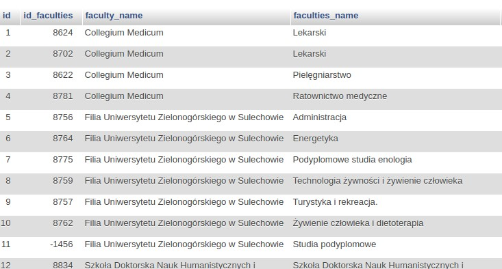

# PlanUZ Parser
## Web scrapping
### University of Zielona Góra timetable
June 2020

## Technologies and tools
- **Python** (version 3.7.3.)
- **MariaDB** database (server version: 10.1.45)
- **virtualenv** and **pip** - package manager and python isolation tool
    - **mysql-connector-python** - MySQL driver - python library for
connecting to MySQL (both MariaDB)
    - **requests** - python library for establishing HTTP/1.1 connections
    - **BeautyfulSoap** - a python library for extracting data from HTML

## Architecture

## Database - structure

** Tables - Description **

- **rawdata** - This table contains data downloaded from the
University of Zielona Góra's HTML server before parsing.
- **faculties** - This table contains information about faculties after
parsing.
- **groups** - This is a table containing the list and names of all
groups after parsing.
- **plans** - This table contains all timetables after parsing.

## Application structure

**Application structure - description**
- **config**.py - storage of configuration variables
- **sql**.py - storing SQL queries
- **database**.py - connection to and operations on the database
- **plan-uz**.py - launch console application
- **plan**.py - application management methods
- **parserPlan**.py - retrieve data from the plan page and save
them in the database

## Launching the Application

[Fig.] Result of running the application using *python plan-uz.py* without specifying any argument.

[Fig.] Launching the application cont...

We then ran our application using the ***python*** command ***plan-uz.py -a***. A dialogue appeared
taking one of the values:
- **recreate**: deletes and re-creates the tables and retrieves the data depending on the
selected target as our argument
- **update**: fetches the data anew according to the selected target as our argument
- **cancel**: exit application

## Launching the Application cont...

[Fig.] Downloading directions

[Fig.] End of downloading directions, start of downloading lesson plans.

[Fig.] The end of downloading lesson plans.

## Comparison timetable pages vs data added to the database

## Faculties 

[Fig.] UZ plan

[Fig.] Application Database

## List of groups of a particular course

[Fig.] UZ plan

[Fig.] Application Database

## Timetable

[Fig.] UZ plan

[Fig.] Application Database

[Fig.] Application Database formatted

